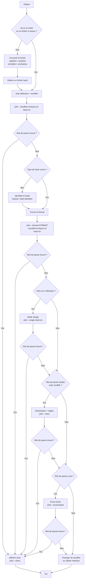

# JOHN THE RIPPER — COURS COMPLET ET SYNTHÉTIQUE

## 1. Présentation générale

**John the Ripper (JTR)** est un outil de **cassage de mots de passe par attaque hors-ligne**, à partir de **hashes** ou de fichiers protégés.

La version la plus utilisée est **John Jumbo**, qui étend considérablement le nombre de formats supportés.

### Usages principaux

* Cassage de hashes simples (MD5, SHA-1, SHA-256, etc.)
* Cassage de hashes système :

  * Linux (`/etc/shadow`)
  * Windows (NTLM)
* Cassage de mots de passe de fichiers protégés :

  * ZIP
  * RAR
* Cassage de mots de passe de clés privées SSH (`id_rsa`)
* Attaques par :

  * dictionnaire (wordlist)
  * mode single
  * règles personnalisées

---

## 2. Rappels fondamentaux de cryptographie

### 2.1 Hash

Un **hash** est le résultat d’une **fonction cryptographique à sens unique**.

* Mot de passe → fonction de hash → hash
* Il est **impossible de retrouver directement** le mot de passe à partir du hash

Exemples courants :

* MD5
* SHA-1
* SHA-256
* NTLM (Windows)

### 2.2 Principe du cracking

John ne décrypte pas un hash. Il procède par comparaison.

1. Prendre une liste de mots (wordlist)
2. Appliquer la même fonction de hash à chaque mot
3. Comparer avec le hash cible
4. Si égalité → mot de passe trouvé

---

## 3. Syntaxe générale de John

```bash
john [options] [fichier_de_hash]
```

Le fichier de hash peut provenir :

* d’un hash manuel
* d’un fichier système
* d’un outil de conversion (zip2john, rar2john, ssh2john, unshadow)

---

## 4. Méthode standard recommandée

### 4.1 Première tentative (auto-détection)

Toujours commencer **sans forcer le format**.

```bash
john --wordlist=/usr/share/wordlists/rockyou.txt hash.txt
```

### 4.2 Affichage des résultats

```bash
john --show hash.txt
```

Cette méthode suffit dans la majorité des cas (CTF, labs TryHackMe).

---

## 5. Identification d’un hash

Si John échoue à détecter le format automatiquement :

Outils possibles :

* `hashid`
* `hash-identifier`
* Bases en ligne spécialisées

Objectif : identifier **le type exact de hash** pour forcer le format.

---

## 6. Forcer un format spécifique

```bash
john --format=[format] --wordlist=/usr/share/wordlists/rockyou.txt hash.txt
```

### Formats courants

| Type de hash | Format John |
| ------------ | ----------- |
| MD5          | raw-md5     |
| SHA-1        | raw-sha1    |
| SHA-256      | raw-sha256  |
| NTLM         | NT          |

Exemple :

```bash
john --format=raw-sha1 --wordlist=/usr/share/wordlists/rockyou.txt hash.txt
```

---

## 7. Hashes Windows (NTLM)

### 7.1 Généralités

* Windows stocke les mots de passe sous forme **NTLM**
* Les hashes proviennent souvent de :

  * SAM
  * NTDS.dit
  * mimikatz

Deux approches :

* Pass-the-Hash (sans casser)
* Cassage du hash avec John

### 7.2 Commande NTLM

```bash
john --format=NT --wordlist=/usr/share/wordlists/rockyou.txt ntlm.txt
```

---

## 8. Hashes Linux (/etc/shadow)

### 8.1 Principe

Les mots de passe Linux sont stockés dans `/etc/shadow`, combinant :

* username
* salt
* hash

### 8.2 Préparation avec unshadow

```bash
unshadow passwd shadow > linux_hash.txt
```

Puis :

```bash
john --wordlist=/usr/share/wordlists/rockyou.txt linux_hash.txt
```

---

## 9. Mode Single Crack

### 9.1 Principe

Le **single mode** génère des mots de passe à partir :

* du nom d’utilisateur
* d’informations connues (login, variations simples)

### 9.2 Commande

```bash
john --single hash.txt
```

Efficace lorsque le mot de passe est dérivé du nom d’utilisateur.

---

## 10. Règles personnalisées

### 10.1 Principe

Les **rules** permettent de transformer automatiquement les mots de la wordlist :

* majuscules
* chiffres ajoutés
* substitutions (a → @, o → 0, etc.)

### 10.2 Utilisation

```bash
john --wordlist=rockyou.txt --rules hash.txt
```

Les règles sont définies dans `john.conf`.

---

## 11. Cassage de fichiers ZIP protégés

### 11.1 Conversion avec zip2john

```bash
zip2john archive.zip > zip_hash.txt
```

### 11.2 Cassage

```bash
john --wordlist=/usr/share/wordlists/rockyou.txt zip_hash.txt
```

---

## 12. Cassage de fichiers RAR protégés

### 12.1 Conversion avec rar2john

```bash
rar2john archive.rar > rar_hash.txt
```

### 12.2 Cassage

```bash
john --wordlist=/usr/share/wordlists/rockyou.txt rar_hash.txt
```

---

## 13. Cassage de clés privées SSH (id_rsa)

### 13.1 Principe

Une clé privée SSH peut être protégée par un mot de passe.
John permet de casser ce mot de passe.

### 13.2 Conversion avec ssh2john

Selon l’environnement :

```bash
ssh2john id_rsa > id_rsa_hash.txt
```

ou :

```bash
python3 /opt/john/ssh2john.py id_rsa > id_rsa_hash.txt
```

### 13.3 Cassage

```bash
john --wordlist=/usr/share/wordlists/rockyou.txt id_rsa_hash.txt
```

---

## 14. Commandes utiles

### Lister les formats supportés

```bash
john --list=formats
```

### Filtrer les formats

```bash
john --list=formats | grep sha
```

### Afficher les mots de passe trouvés

```bash
john --show hash.txt
```

---

## 15. Pièges fréquents

* `--list=formats` ne lance **aucun cassage**
* `grep` avec `|` interrompt l’exécution de John
* Toujours tester **sans --format** en premier
* Les formats `raw-*` correspondent à des hashes simples
* Ne pas oublier `john --show`

---

## 16. Méthode de travail recommandée (CTF / TryHackMe)

1. Lancer John avec une wordlist et auto-détection
2. Si échec, identifier le hash
3. Forcer le format adapté
4. Vérifier les résultats avec `john --show`

Voici ce que **j’ajouterais à la fin du cours**, en restant **pertinent, précis et utile**, sans alourdir inutilement.

---

## 17. Gestion des sessions et reprise de cassage

### 17.1 Fonctionnement des sessions John

John sauvegarde automatiquement l’état d’un cassage dans des fichiers de session.
Cela permet d’arrêter et reprendre une attaque sans perdre la progression.

Par défaut :

* Les sessions sont stockées dans `~/.john/`
* Une session est créée automatiquement si aucun nom n’est précisé

### 17.2 Nommer une session

```bash
john --session=ma_session --wordlist=rockyou.txt hash.txt
```

### 17.3 Reprendre une session

```bash
john --restore=ma_session
```

### 17.4 Lister les sessions actives

```bash
ls ~/.john/
```

---

## 18. Attaques par force brute (incremental)

### 18.1 Principe

Le **mode incremental** teste toutes les combinaisons possibles de caractères selon un jeu défini.
Il est beaucoup plus lent qu’un dictionnaire, mais utile si :

* le mot de passe est court
* aucune wordlist ne fonctionne

### 18.2 Commande de base

```bash
john --incremental hash.txt
```

### 18.3 Jeux de caractères courants

* `Lower` : minuscules
* `Upper` : majuscules
* `Digits` : chiffres
* `Alnum` : lettres + chiffres

Exemple :

```bash
john --incremental=Digits hash.txt
```

---

## 19. Performance et optimisation

### 19.1 Vérifier l’utilisation CPU

John utilise automatiquement tous les cœurs disponibles.
Aucune option spécifique n’est nécessaire.

### 19.2 Comparaison avec Hashcat

* John the Ripper :

  * très polyvalent
  * excellent pour formats complexes (shadow, SSH, ZIP, RAR)

* Hashcat :

  * beaucoup plus rapide (GPU)
  * moins flexible sur certains formats

Dans les labs et examens, John est souvent suffisant.

### 1. Comparaison John / Hashcat (tableau)

Utile pour savoir quand utiliser l’un ou l’autre.

### 2. Structure interne d’un hash complexe

Expliquer brièvement :

* salt
* rounds
* identifiant d’algorithme (ex: `$6$` pour SHA-512 Linux)

### 3. Wordlists avancées

* SecLists
* génération de wordlists ciblées (profil utilisateur)
* nettoyage et tri de wordlists

### 4. Erreurs typiques en examen

* mauvais format forcé
* oubli de `john --show`
* fichier hash mal préparé (zip2john non utilisé)

---

## Conclusion finale

Ce cours couvre **100 % des usages essentiels de John the Ripper** rencontrés en :

* CTF
* TryHackMe
* examens de cybersécurité
* premières missions d’audit

Au-delà, les gains deviennent marginaux par rapport à la complexité ajoutée.

## Bonus : schéma d'utilisation 




